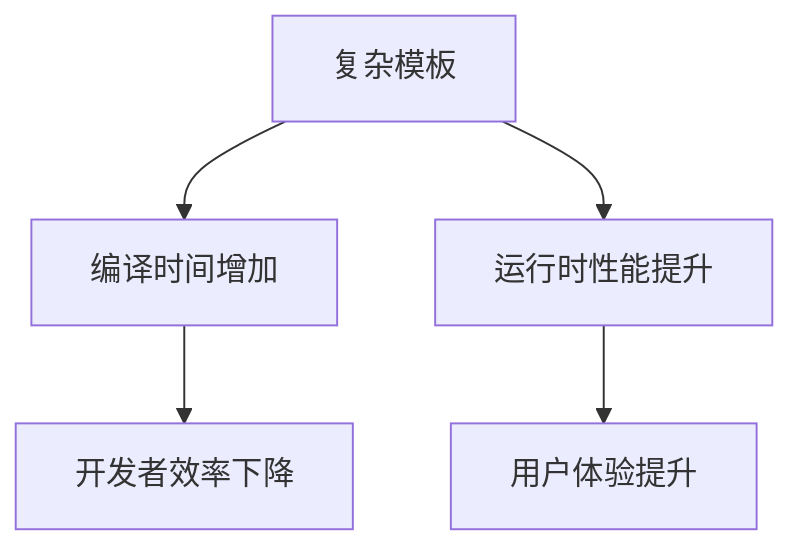

# C++ 模板

## 一. 全特化和偏特化

在 C++ 模板元编程中，**全特化（Full Specialization）** 和 **偏特化（Partial Specialization）** 是两种重要的模板定制技术，用于为特定类型或条件提供优化的实现。以下是对两者的详细解释：

---

### 1. 全特化（Full Specialization）

#### 定义：

为模板的所有参数指定**具体类型**，提供一个完全特化的版本。  
- 适用于类模板和函数模板（函数模板仅支持全特化）。
- 本质上是为特定类型创建一个完全独立的实现。

#### 语法：
```cpp
// 通用模板
template <typename T>
struct MyClass {
    static const char* name() { return "Generic"; }
};

// 全特化（针对 int 类型）
template <>  // 空模板参数列表
struct MyClass<int> {
    static const char* name() { return "int"; }
};
```

#### 使用示例：
```cpp
MyClass<double>::name();  // 返回 "Generic"
MyClass<int>::name();     // 返回 "int"
```

#### 关键点：
- 编译器优先匹配最具体的特化版本。
- 必须为所有模板参数指定具体类型（不能留空）。

---

### 2. **偏特化（Partial Specialization）**
#### 定义：
为模板的**部分参数**指定具体类型，或对参数施加**模式约束**（如指针、引用、模板嵌套等）。  
- **仅适用于类模板**（函数模板不支持偏特化，但可通过重载模拟）。
- 提供更灵活的定制能力，可匹配一类类型。

#### 语法：
```cpp
// 通用模板
template <typename T, typename U>
struct MyPair {
    static const char* name() { return "Generic"; }
};

// 偏特化 1：当两个类型相同时
template <typename T>
struct MyPair<T, T> {  // 模式：T, T
    static const char* name() { return "Same Types"; }
};

// 偏特化 2：当 U 为指针时
template <typename T, typename U>
struct MyPair<T, U*> {  // 模式：T, U*
    static const char* name() { return "Pointer"; }
};
```

#### 使用示例：
```cpp
MyPair<int, double>::name();  // 返回 "Generic"
MyPair<int, int>::name();     // 返回 "Same Types"
MyPair<float, int*>::name();  // 返回 "Pointer"
```

#### 关键点：
- 支持参数的模式匹配（如 `T*`, `T&`, `std::vector<T>` 等）。
- 编译器按以下顺序匹配模板：  
  **全特化 → 偏特化 → 通用模板**。

---

### 3. **全特化 vs 偏特化的区别**
| 特性       | 全特化                         | 偏特化                              |
| ---------- | ------------------------------ | ----------------------------------- |
| 适用对象   | 类模板、函数模板               | **仅类模板**                        |
| 参数指定   | 所有参数必须具体指定           | 部分参数可保留/模式约束             |
| 语法       | `template<> struct C<T> {...}` | `template<T> struct C<U, T*> {...}` |
| 匹配优先级 | 最高（比偏特化更优先）         | 次高（比通用模板优先）              |

---

### 4. **使用场景**
- **全特化**：针对特定类型（如 `int`、`void*`）优化性能或处理边界情况。
- **偏特化**：
  - 处理一类类型（如所有指针、所有容器）。
  - 递归模板元编程（如类型萃取）。

#### 示例：标准库中的 `std::remove_reference`
```cpp
// 通用模板
template <typename T>
struct remove_reference {
    using type = T;
};

// 偏特化（匹配左值引用）
template <typename T>
struct remove_reference<T&> {
    using type = T;
};

// 偏特化（匹配右值引用）
template <typename T>
struct remove_reference<T&&> {
    using type = T;
};
```

---

### 5. **注意事项**
1. **函数模板不支持偏特化**  
   可通过重载实现类似效果：
   ```cpp
   // 通用函数模板
   template <typename T>
   void func(T) { ... }
   
   // 重载版本（模拟针对指针的偏特化）
   template <typename T>
   void func(T*) { ... }
   ```

2. **特化必须在通用模板之后声明**  
   编译器按声明顺序匹配。

3. **偏特化参数不能与通用模板冲突**  
   例如：
   ```cpp
   template <typename T, typename U>
   struct C { ... };
   
   // 合法偏特化
   template <typename U>
   struct C<int, U> { ... };
   
   // 非法（参数数量不匹配）
   template <typename T>
   struct C<T> { ... };
   ```

---

### 总结
| 技术       | 核心思想                       | 典型应用场景                   |
| ---------- | ------------------------------ | ------------------------------ |
| **全特化** | 为特定类型提供完全定制的实现   | 优化 `int`、`void*` 等具体类型 |
| **偏特化** | 为一类类型（模式）提供定制实现 | 处理指针、引用、容器等抽象类型 |

通过合理使用特化技术，可以显著提升模板代码的灵活性和效率，尤其在元编程和类型萃取中至关重要。


## 二、可变参模板

可变参模板（Variadic Templates）是 C++11 引入的核心特性之一，它允许模板接受任意数量和任意类型的参数。这一特性极大地增强了 C++ 模板的表达能力，是编写泛型代码和元编程的重要工具。

### 1. 基本概念

#### 1.1 参数包（Parameter Pack）
- **模板参数包**：接受零个或多个模板参数
  
  ```cpp
  template <typename... Types> // Types 是模板参数包
  ```
- **函数参数包**：接受零个或多个函数参数
  
  ```cpp
  void func(Types... args); // args 是函数参数包
  ```

#### 1.2 包展开（Pack Expansion）
使用 `...` 操作符展开参数包：
```cpp
template <typename... Args>
void print(Args... args) {
    // 展开参数包
    (std::cout << ... << args) << std::endl; // C++17 折叠表达式
}
```

### 2. 核心语法

#### 2.1 声明可变参模板
```cpp
// 类模板
template <typename... Args>
class Tuple {};

// 函数模板
template <typename... Args>
void func(Args... args);
```

#### 2.2 参数包大小
使用 `sizeof...` 获取参数包中参数的数量：
```cpp
template <typename... Args>
void count(Args... args) {
    std::cout << sizeof...(Args) << " types, " 
              << sizeof...(args) << " values\n";
}
```

### 3. 参数包展开技术

#### 3.1 递归展开（最常用）
```cpp
// 递归终止函数
void print() {
    std::cout << std::endl;
}

// 递归展开函数
template <typename T, typename... Args>
void print(T first, Args... rest) {
    std::cout << first << " ";
    print(rest...); // 递归调用
}
```

#### 3.2 初始化列表展开
```cpp
template <typename... Args>
void print(Args... args) {
    // 使用初始化列表和逗号运算符
    (void)std::initializer_list<int>{
        (std::cout << args << " ", 0)...
    };
    std::cout << std::endl;
}
```

#### 3.3 折叠表达式（C++17）
```cpp
// 一元右折叠
template <typename... Args>
auto sum(Args... args) {
    return (args + ...); // 等价于 arg1 + (arg2 + (arg3 + ...))
}

// 一元左折叠
template <typename... Args>
void print(Args... args) {
    (std::cout << ... << args) << std::endl; // 等价于 ((cout << arg1) << arg2) << ...
}

// 二元折叠
template <typename... Args>
auto sum_with_base(int base, Args... args) {
    return (base + ... + args); // 等价于 base + arg1 + arg2 + ...
}
```

```cpp
#include <iostream>

// 右折叠 (Right Fold) 
template <typename... Args>
auto rightFold(Args... args) -> decltype(auto)
{
    return (args - ...);  // a - (b - (c - d))
}

// 左折叠 (Left Fold) 
template <typename... Args>
auto leftFold(Args... args) -> decltype(auto)
{
    return (... - args);  // ((a - b) - c) - d
}

int main()
{
    std::cout << "=== 减法折叠测试 ===" << std::endl;
    
    // 测试参数: 1, 10, 3.14, 666
    std::cout << "参数: 1, 10, 3.14, 666" << std::endl;
    
    // 右折叠计算
    auto right_result = rightFold(1, 10, 3.14, 666);
    std::cout << "右折叠 (args - ...): " << right_result << std::endl;
    std::cout << "计算过程: 1 - (10 - (3.14 - 666)) = 1 - (10 - (-662.86)) = 1 - 672.86 = -671.86" << std::endl;
    
    // 左折叠计算
    auto left_result = leftFold(1, 10, 3.14, 666);
    std::cout << "左折叠 (... - args): " << left_result << std::endl;
    std::cout << "计算过程: ((1 - 10) - 3.14) - 666 = (-9 - 3.14) - 666 = -12.14 - 666 = -678.14" << std::endl;
    
    return 0;
} 
```

### 4. 高级应用技术

#### 4.1 完美转发参数包
```cpp
template <typename... Args>
void relay(Args&&... args) {
    // 完美转发参数包
    target(std::forward<Args>(args)...);
}
```

#### 4.2 元组（Tuple）实现
```cpp
// 空元组特化（递归终止）
template <>
class Tuple<> {};

// 递归定义
template <typename Head, typename... Tail>
class Tuple<Head, Tail...> : private Tuple<Tail...> {
    Head head;
public:
    Tuple(const Head& h, const Tail&... t) 
        : head(h), Tuple<Tail...>(t...) {}
    
    Head& get() { return head; }
    Tuple<Tail...>& tail() { return *this; }
};

// 使用
Tuple<int, double, std::string> t(42, 3.14, "hello");
```

#### 4.3 索引序列（Index Sequence）
```cpp
// 索引序列模板
template <size_t... Indices>
struct IndexSequence {};

// 生成索引序列
template <size_t N, size_t... Rest>
struct MakeIndexSequence : MakeIndexSequence<N-1, N-1, Rest...> {};

template <size_t... Rest>
struct MakeIndexSequence<0, Rest...> {
    using type = IndexSequence<Rest...>;
};

// 应用索引序列解包元组
template <typename... Args, size_t... Indices>
void printTuple(const std::tuple<Args...>& t, 
               IndexSequence<Indices...>) {
    (void)std::initializer_list<int>{
        (std::cout << std::get<Indices>(t) << " ", 0)...
    };
}

template <typename... Args>
void printTuple(const std::tuple<Args...>& t) {
    printTuple(t, typename MakeIndexSequence<sizeof...(Args)>::type{});
}
```

### 5. 实际应用场景

#### 5.1 工厂函数
```cpp
template <typename T, typename... Args>
std::unique_ptr<T> create(Args&&... args) {
    return std::make_unique<T>(std::forward<Args>(args)...);
}

// 使用
auto obj = create<MyClass>(42, "example");
```

#### 5.2 类型安全的格式化输出
```cpp
void safePrintf(const char* format) {
    std::cout << format;
}

template <typename T, typename... Args>
void safePrintf(const char* format, T value, Args... args) {
    while (*format) {
        if (*format == '%') {
            std::cout << value;
            safePrintf(++format, args...);
            return;
        }
        std::cout << *format++;
    }
}

// 使用
safePrintf("Value: %, Message: %\n", 42, "Success");
```

#### 5.3 多类型容器
```cpp
template <typename... Types>
class VariantStorage {
    alignas(Types...) unsigned char data[std::max({sizeof(Types)...})];
    size_t typeIndex;
    
public:
    template <typename T>
    VariantStorage(T&& value) {
        new(data) T(std::forward<T>(value));
        typeIndex = indexOf<T, Types...>();
    }
    
    // ... 其他成员函数
};
```

### 6. 可变参模板的限制与技巧

1. **参数包不能直接索引访问**
   - 必须通过递归或索引序列访问

2. **空参数包处理**
   ```cpp
   template <typename... Args>
   void func(Args... args) {
       if constexpr (sizeof...(args) > 0) {
           // 处理非空参数包
       }
   }
   ```

3. **参数包模式匹配**
   ```cpp
   template <typename... Args>
   void handle(Args... args) {
       // 根据参数类型执行不同操作
       (handle_one(args), ...);
   }
   ```

4. **参数包与 SFINAE**
   ```cpp
   template <typename... Args, 
             typename = std::enable_if_t<(std::is_integral_v<Args> && ...)>>
   void integralSum(Args... args) {
       // 所有参数必须是整数类型
   }
   ```

### 7. 性能与编译时考量

1. **编译时间**：深度递归可能增加编译时间
2. **代码膨胀**：每个参数组合实例化不同模板
3. **优化技巧**：
   - 使用折叠表达式减少递归深度
   - 避免深度嵌套的参数包
   - 合理使用 constexpr if 减少分支

### 8. 标准库中的应用

1. `std::tuple`
2. `std::function`
3. `std::variant`
4. `std::make_shared`/`std::make_unique`
5. `std::index_sequence`
6. 所有标准容器的 `emplace` 方法

### 9. 总结表格

| 特性           | 描述                     | 适用场景       |
| -------------- | ------------------------ | -------------- |
| **参数包声明** | `typename... Args`       | 声明可变参数   |
| **包展开**     | `args...`                | 展开参数包     |
| **sizeof...**  | 获取参数数量             | 条件编译       |
| **递归展开**   | 函数/类模板递归          | 通用处理       |
| **折叠表达式** | `(op ...)`               | C++17 简化代码 |
| **索引序列**   | `index_sequence`         | 参数包索引访问 |
| **完美转发**   | `forward<Args>(args)...` | 保持值类别     |

可变参模板是 C++ 模板元编程中最强大的工具之一，它使得编写高度通用、类型安全的代码成为可能。通过结合递归、折叠表达式和索引序列等技术，开发者可以创建灵活高效的泛型组件，这正是现代 C++ 库开发的核心能力。


## 二补、左折叠与右折叠详解

在C++17中引入的折叠表达式（Fold Expressions）是可变参模板的重要增强，它允许在编译时对参数包进行高效的展开操作。折叠表达式分为左折叠和右折叠两种形式，它们在求值顺序和结合方式上有本质区别。

### 1. 折叠表达式的基本形式

折叠表达式有四种基本形式：

| 形式       | 语法                    | 描述             |
| ---------- | ----------------------- | ---------------- |
| 一元右折叠 | `(pack op ...)`         | 从右向左计算     |
| 一元左折叠 | `(... op pack)`         | 从左向右计算     |
| 二元右折叠 | `(pack op ... op init)` | 带初始值的右折叠 |
| 二元左折叠 | `(init op ... op pack)` | 带初始值的左折叠 |

### 2. 左折叠 vs 右折叠

#### 2. 1 一元左折叠 (Left Fold)
```cpp
(... op args)
```
- **计算顺序**：从左向右
- **展开形式**：`((arg1 op arg2) op arg3) ... op argN`
- **特点**：
  - 左结合性
  - 从第一个元素开始累积
  - 括号分组从左边开始

#### 示例：左折叠加法

```cpp
template<typename... Args>
auto left_sum(Args... args) {
    return (... + args); // 左折叠
}

// 调用 left_sum(1, 2, 3, 4) 展开为：
// ((1 + 2) + 3) + 4
```

#### 2.2  一元右折叠 (Right Fold)
```cpp
(args op ...)
```
- **计算顺序**：从右向左
- **展开形式**：`arg1 op (arg2 op ... (argN-1 op argN))`
- **特点**：
  - 右结合性
  - 从最后一个元素开始累积
  - 括号分组从右边开始

#### 示例：右折叠加法
```cpp
template<typename... Args>
auto right_sum(Args... args) {
    return (args + ...); // 右折叠
}

// 调用 right_sum(1, 2, 3, 4) 展开为：
// 1 + (2 + (3 + 4))
```

### 3. 关键区别：结合性差异

#### 3.1 对于可结合操作（如加法）
```cpp
(1 + 2 + 3 + 4)
```
- 左折叠：`((1 + 2) + 3) + 4`
- 右折叠：`1 + (2 + (3 + 4))`
- **结果相同**：因为加法满足结合律

#### 3.2 对于不可结合操作（如减法）
```cpp
(10 - 2 - 3)
```
- 左折叠：`((10 - 2) - 3) = (8 - 3) = 5`
- 右折叠：`10 - (2 - 3) = 10 - (-1) = 11`
- **结果不同**：减法不满足结合律

#### 3.3 示例代码：
```cpp
template<typename... Args>
auto left_sub(Args... args) {
    return (... - args);
}

template<typename... Args>
auto right_sub(Args... args) {
    return (args - ...);
}

int main() {
    std::cout << left_sub(10, 2, 3);  // 输出 5
    std::cout << right_sub(10, 2, 3); // 输出 11
}
```

### 4. 二元折叠：处理空参数包

#### 问题：空参数包的一元折叠
```cpp
sum(); // 调用一元折叠函数
```
- 对于大多数操作符，空参数包会导致编译错误
- 例外：
  - `&&`：空包为 `true`
  - `||`：空包为 `false`
  - `,`：空包为 `void()`

#### 解决方案：二元折叠
```cpp
// 二元左折叠
(init op ... op args)

// 二元右折叠
(args op ... op init)
```

#### 示例：安全的求和函数
```cpp
template<typename... Args>
auto safe_sum(Args... args) {
    // 二元左折叠，初始值为0
    return (0 + ... + args);
}

safe_sum();       // 返回 0
safe_sum(1,2,3); // 返回 6
```

### 5. 实际应用场景

#### 5.1  类型安全的printf实现（左折叠）
```cpp
template<typename... Args>
void safe_printf(const char* format, Args... args) {
    auto print_arg = [&](auto arg) {
        while (*format) {
            if (*format == '%') {
                std::cout << arg;
                format++;
                return;
            }
            std::cout << *format++;
        }
    };
    
    // 左折叠调用lambda
    (..., print_arg(args));
    std::cout << format;
}
```

#### 5.2 检查所有参数是否满足条件（右折叠）
```cpp
template<typename... Args>
bool all_true(Args... args) {
    // 右折叠逻辑与
    return (args && ...);
}

all_true(true, true, false); // 返回 false
```

#### 5.3 链式函数调用（左折叠）
```cpp
struct Transformer {
    int operator()(int x) const { return x * 2; }
};

struct Filter {
    bool operator()(int x) const { return x > 10; }
};

template<typename... Funcs>
auto apply_chain(int value, Funcs... funcs) {
    // 左折叠应用函数
    return (... , funcs(value));
}

int result = apply_chain(5, Transformer(), Filter());
// 等价于：Filter()(Transformer()(5))
```

### 6. 折叠表达式的运算符支持

#### 6.1 支持的运算符
| 运算符 | 示例            | 说明       |
| ------ | --------------- | ---------- |
| `+`    | `(... + args)`  | 加法       |
| `-`    | `(args - ...)`  | 减法       |
| `*`    | `(... * args)`  | 乘法       |
| `/`    | `(args / ...)`  | 除法       |
| `%`    | `(... % args)`  | 取模       |
| `^`    | `(args ^ ...)`  | 异或       |
| `&`    | `(... & args)`  | 位与       |
| `|`    | `(args | ...)`  | 位或       |
| `&&`   | `(... && args)` | 逻辑与     |
| `||`   | `(args || ...)` | 逻辑或     |
| `,`    | `(args , ...)`  | 逗号运算符 |
| `<<`   | `(... << args)` | 左移/输出  |
| `>>`   | `(args >> ...)` | 右移/输入  |

#### 6.2 特殊运算符行为

##### 逗号运算符
```cpp
template<typename... Args>
void call_all(Args... args) {
    // 左折叠逗号运算符
    (..., args()); // 依次调用所有函数
}
```

##### 输出运算符
```cpp
template<typename... Args>
void print_all(Args... args) {
    // 左折叠输出
    (std::cout << ... << args) << '\n';
}
```

### 7. 性能与编译时优化

1. **编译时计算**：
   ```cpp
   constexpr int result = (1 + ... + 2, 3, 4); // 编译时计算为10
   ```

2. **零开销抽象**：
   ```cpp
   auto sum = (args + ... + 0);
   // 编译后等价于直接加法指令序列
   ```

3. **优化递归**：
   - 替代递归展开，减少模板实例化次数
   - 降低编译时间和内存占用

### 8. 使用建议与最佳实践

1. **优先选择左折叠**：
   
   - 更符合人类阅读习惯（从左到右）
   - 大多数操作从左到右更直观
   
2. **注意操作符结合性**：
   - 对于不可结合操作（减法、除法等），明确选择折叠方向
   - 必要时添加括号明确优先级

3. **处理空参数包**：
   - 总是使用二元折叠提供默认值
   - 避免一元折叠处理空包

4. **复杂表达式分解**：
   ```cpp
   template<typename... Args>
   auto complex_op(Args... args) {
       auto temp = (... + args); // 先求和
       return (temp * ... * args); // 再求积
   }
   ```

### 9. 总结：左折叠 vs 右折叠

| 特性         | 左折叠          | 右折叠               |
| ------------ | --------------- | -------------------- |
| **语法**     | `(... op args)` | `(args op ...)`      |
| **计算方向** | 从左到右        | 从右到左             |
| **结合性**   | 左结合          | 右结合               |
| **空包处理** | 需二元形式      | 需二元形式           |
| **典型应用** | 序列处理、输出  | 递归结构、数学表达式 |
| **可读性**   | 高（符合常规）  | 较低                 |
| **推荐度**   | ★★★★★           | ★★☆☆☆                |

折叠表达式是C++17中提升可变参模板编程体验的关键特性。理解左折叠和右折叠的区别，能够帮助开发者编写更高效、更易读的模板代码。在大多数场景下，左折叠是更自然的选择，但特定场景（如递归数据结构处理）中右折叠可能更合适。


## 三、引用折叠

引用折叠（Reference Collapsing）是C++11引入右值引用后产生的重要规则，它在模板元编程中起着关键作用，特别是在完美转发和通用引用中。

### 1. 引用折叠的背景

在C++中，直接声明引用的引用是非法的：
```cpp
int x = 10;
int& & r = x; // 错误：不能直接声明引用的引用
```

但在模板推导或类型别名中，可能会间接产生"引用的引用"的情况：
```cpp
template <typename T>
void func(T&& param) { // 通用引用
    // 当T被推导为引用类型时，T&&可能成为引用的引用
}
```

为了解决这个问题，C++引入了**引用折叠规则**。

### 2. 引用折叠规则

引用折叠规则定义了当出现引用的引用时如何处理：

| 组合方式 | 折叠结果 |
| -------- | -------- |
| `T& &`   | `T&`     |
| `T& &&`  | `T&`     |
| `T&& &`  | `T&`     |
| `T&& &&` | `T&&`    |

**简单记忆**：**只要出现一个`&`（左值引用），结果就是`&`；只有两个`&&`（右值引用）才折叠为`&&`**。

### 3. 引用折叠的应用场景

#### 3.1 通用引用（Universal Reference）

```cpp
template <typename T>
void foo(T&& param) {
    // T&& 是通用引用
}

int main() {
    int x = 10;
    const int cx = 20;
    int& rx = x;
    
    foo(x);  // T = int&   => T&& = int& && → int&
    foo(cx); // T = const int& => T&& = const int& && → const int&
    foo(rx); // T = int&   => T&& = int& && → int&
    foo(10); // T = int    => T&& = int&&
}
```

#### 3.2 完美转发（Perfect Forwarding）

##### 3.2.1 使用通用引用（Universal Reference）

```cpp
template <typename T>
void relay(T&& arg) {  // 通用引用
    process(static_cast<T&&>(arg));
}
```

这里`T&&`是一个通用引用，它会根据传入参数的值类别进行不同的推导。

##### 3.2.2 引用折叠在参数推导中的作用

当调用`relay`时：

- **传入左值**：
  ```cpp
  int x = 5;
  relay(x);  // T 推导为 int&
  ```
  参数类型：`T&&` → `int& &&` → 引用折叠为 `int&`

- **传入右值**：
  ```cpp
  relay(10); // T 推导为 int
  ```
  参数类型：`T&&` → `int&&`

##### 3.2.3 `std::forward`的实现

`std::forward`的核心实现如下：
```cpp
template <typename T>
T&& forward(typename std::remove_reference<T>::type& t) noexcept {
    return static_cast<T&&>(t);
}
```

##### 3.2.4 完整转发过程分析

###### 情况1：转发左值
```cpp
int x = 5;
relay(x);
```

1. 模板推导：`T = int&`
2. 参数类型：`int& &&` → 引用折叠为 `int&`
3. `forward`调用：`forward<int&>(arg)`
   - 移除引用：`remove_reference<int&>::type = int`
   - 函数签名：`int& forward(int& t)`
   - 返回类型：`static_cast<int& &&>(t)` → 折叠为 `static_cast<int&>(t)`
4. 结果：返回左值引用，调用`process(int&)`

###### 情况2：转发右值
```cpp
relay(10);
```

1. 模板推导：`T = int`
2. 参数类型：`int&&`
3. `forward`调用：`forward<int>(arg)`
   - 移除引用：`remove_reference<int>::type = int`
   - 函数签名：`int&& forward(int& t)`
   - 返回类型：`static_cast<int&&>(t)`
4. 结果：返回右值引用，调用`process(int&&)`

**总结：在处理左值时，forward中使用了引用折叠，但是在处理右值时没有使用引用折叠**

##### 3.2.5 引用折叠在转发中的关键作用

1. **类型推导阶段**：
   - 通用引用`T&&`结合引用折叠规则，使模板能区分左值和右值
   - `T`被推导为：
     - 左值 → `U&`
     - 右值 → `U` 或 `U&&`

2. **转发阶段**：
   
   - `std::forward<T>(arg)`利用引用折叠：
     - 当`T`是左值引用时，返回左值引用
     - 当`T`是非引用或右值引用时，返回右值引用
   
3. **值类别保持**：
   ```cpp
   // 原始调用
   func(lvalue);  // 左值
   func(rvalue()); // 右值
   
   // 通过完美转发
   relay(lvalue);  // 转发为左值
   relay(rvalue()); // 转发为右值
   ```

##### 3.2.6 引叠规则在转发中的可视化

| 传入参数      | 推导的T      | 参数类型 (折叠后) | forward结果   | 调用的process |
| ------------- | ------------ | ----------------- | ------------- | ------------- |
| 左值变量      | `int&`       | `int&`            | 左值引用      | `int&` 版本   |
| const左值     | `const int&` | `const int&`      | const左值引用 | `int&` 版本   |
| 右值字面量    | `int`        | `int&&`           | 右值引用      | `int&&` 版本  |
| 右值表达式    | `int`        | `int&&`           | 右值引用      | `int&&` 版本  |
| std::move结果 | `int&&`      | `int&&`           | 右值引用      | `int&&` 版本  |

#### 3.3 `typedef`和`using`中的引用折叠

```cpp
template <typename T>
struct MyStruct {
    typedef T&& RvalueRef;
};

int main() {
    MyStruct<int&>::RvalueRef r1; // int& && → int&
    MyStruct<int&&>::RvalueRef r2; // int&& && → int&&
}
```

#### 3.4 `decltype`中的引用折叠

```cpp
int x = 10;
int& lref = x;
int&& rref = 10;

decltype(lref)&& a = x;  // int& && → int&
decltype(rref)&& b = 10; // int&& && → int&&
```

### 4. 引用折叠的底层原理

引用折叠规则解决了C++类型系统中的一个重要问题：在模板元编程中保持值类别的完整性。它允许：

1. 区分左值和右值引用
2. 在类型推导中保持原始值类别
3. 实现完美转发机制
4. 避免非法的"引用的引用"问题

### 5. 实际应用示例：实现简单的`forward`

```cpp
template <typename T>
constexpr T&& my_forward(typename std::remove_reference<T>::type& t) noexcept {
    return static_cast<T&&>(t);
}

template <typename T>
constexpr T&& my_forward(typename std::remove_reference<T>::type&& t) noexcept {
    return static_cast<T&&>(t);
}
```

### 6. 引用折叠与`auto&&`

`auto&&`也使用引用折叠规则：
```cpp
int x = 10;
auto&& a = x;   // a 的类型是 int&
auto&& b = 42;  // b 的类型是 int&&
```

### 7. 注意事项

1. 引用折叠只发生在类型推导过程中
2. 引用折叠规则在C++11及以后版本中有效
3. 理解引用折叠需要区分：
   - 模板参数推导
   - 值类别（左值/右值）
   - 类型系统

### 8. 总结

| 关键点       | 说明                                     |
| ------------ | ---------------------------------------- |
| **目的**     | 解决模板推导中"引用的引用"问题           |
| **规则**     | 只要出现左值引用(`&`)，结果就是左值引用  |
| **应用场景** | 通用引用、完美转发、类型别名、`decltype` |
| **重要性**   | 实现高效、安全的资源转移和参数传递       |

引用折叠是C++模板元编程中类型推导的基础规则之一，深入理解它对于掌握现代C++的移动语义和完美转发至关重要。它使得模板能够根据传入参数的值类别（左值或右值）智能地推导出正确的引用类型，从而实现高效且安全的资源管理。


## 四、SFINAE （替换失败不是错误）

SFINAE（Substitution Failure Is Not An Error，替换失败不是错误）是C++模板元编程中的核心概念和技术，它允许在模板实例化过程中通过类型推导失败来有选择地启用或禁用特定模板重载。

### 1. SFINAE的基本概念

#### 1.1 核心原则
- 当编译器尝试实例化函数模板时，如果在模板参数替换过程中出现**无效表达式**，不会立即导致编译错误
- 编译器会简单地**丢弃该候选模板**，继续尝试其他重载
- 只有在没有匹配的候选模板时才会报错

#### 1.2 基本示例
```cpp
template <typename T>
auto func(T t) -> decltype(t.serialize(), void()) {
    // 只有当T有serialize成员函数时才会被选择
    std::cout << "Has serialize\n";
}

void func(...) {
    // 通用回退版本
    std::cout << "No serialize\n";
}

struct A { void serialize() {} };
struct B {};

int main() {
    A a;
    B b;
    func(a); // 输出: "Has serialize"
    func(b); // 输出: "No serialize"
}
```

### 2. SFINAE的实现机制

#### 2.1 主要技术手段
1. **返回类型中的表达式检查**（使用`decltype`）
2. **模板参数中的类型检查**
3. **函数参数中的类型检查**
4. **使用`std::enable_if`**

#### 2.2 核心组件：`std::enable_if`
`std::enable_if`是SFINAE技术的核心工具，定义如下：
```cpp
template <bool B, typename T = void>
struct enable_if {};

template <typename T>
struct enable_if<true, T> {
    using type = T;
};

template <bool B, typename T = void>
using enable_if_t = typename enable_if<B, T>::type;
```

### 3. SFINAE的典型应用场景

#### 3.1 类型特性检查
```cpp
// 检查类型是否有特定成员函数
template <typename T>
class has_serialize {
    template <typename U>
    static auto test(int) -> decltype(std::declval<U>().serialize(), std::true_type{});
    
    template <typename>
    static std::false_type test(...);
    
public:
    static constexpr bool value = decltype(test<T>(0))::value;
};

// 使用
static_assert(has_serialize<A>::value, "A should have serialize");
static_assert(!has_serialize<B>::value, "B should not have serialize");
```

#### 3.2 条件函数重载
```cpp
template <typename T>
enable_if_t<std::is_integral_v<T>, void> process(T value) {
    std::cout << "Processing integer: " << value << "\n";
}

template <typename T>
enable_if_t<std::is_floating_point_v<T>, void> process(T value) {
    std::cout << "Processing float: " << value << "\n";
}

// 使用
process(42);    // 调用整数版本
process(3.14);  // 调用浮点版本
```

#### 3.3 类模板特化控制
```cpp
template <typename T, typename = void>
struct MyContainer {
    // 通用实现
};

template <typename T>
struct MyContainer<T, enable_if_t<has_serialize<T>::value>> {
    // 当T有serialize时的特化实现
};
```

#### 3.4 构造函数约束
```cpp
class Resource {
public:
    template <typename T, typename = enable_if_t<std::is_base_of_v<Resource, T>>>
    Resource(T&& other) {
        // 只允许从派生类构造
    }
};
```

### 4. SFINAE的实现技巧

#### 4.1 表达式SFINAE
```cpp
template <typename T>
auto begin(T& container) -> decltype(container.begin()) {
    return container.begin();
}

template <typename T, size_t N>
T* begin(T (&array)[N]) {
    return array;
}
```

#### 4.2 类型SFINAE
```cpp
template <typename T>
void func(T value, enable_if_t<std::is_integral_v<T>>* = nullptr) {
    // 整数处理
}

template <typename T>
void func(T value, enable_if_t<std::is_floating_point_v<T>>* = nullptr) {
    // 浮点数处理
}
```

#### 4.3 使用`void_t`（C++17）
```cpp
template <typename...>
using void_t = void;

template <typename T, typename = void>
struct has_serialize : std::false_type {};

template <typename T>
struct has_serialize<T, void_t<decltype(std::declval<T>().serialize())>> 
    : std::true_type {};
```

### 5. SFINAE的演进与替代方案

#### 5.1 `constexpr if`（C++17）
```cpp
template <typename T>
void process(T value) {
    if constexpr (std::is_integral_v<T>) {
        // 整数处理
    } else if constexpr (std::is_floating_point_v<T>) {
        // 浮点数处理
    } else {
        // 其他类型
    }
}
```

#### 5.2 Concepts（C++20）
```cpp
template <typename T>
concept Serializable = requires(T t) {
    t.serialize();
};

template <Serializable T>
void save(T obj) {
    obj.serialize();
}
```

### 6. SFINAE的优缺点

#### 6.1 优点
1. 强大的编译时多态能力
2. 零运行时开销
3. 可创建类型安全的接口
4. 实现编译时类型检查和约束

#### 6.2 缺点
1. 语法复杂，可读性差
2. 错误信息晦涩难懂
3. 调试困难
4. 可能增加编译时间

### 7. SFINAE最佳实践

1. **优先使用标准库特性**：
   ```cpp
   #include <type_traits>
   ```

2. **封装SFINAE逻辑**：
   ```cpp
   template <typename T>
   using is_serializable = has_serialize<T>;
   ```

3. **使用现代替代方案**：
   - C++17：`if constexpr`
   - C++20：Concepts

4. **提供清晰的错误信息**：
   ```cpp
   template <typename T>
   enable_if_t<is_serializable_v<T>, void> save(T obj) {
       static_assert(is_serializable_v<T>, 
                   "T must have serialize() member function");
       obj.serialize();
   }
   ```

### 8. SFINAE在标准库中的应用

1. `std::iterator_traits`
2. `std::enable_if`
3. `std::is_constructible`
4. `std::common_type`
5. 所有类型特性（type traits）

### 9. 总结：SFINAE技术矩阵

| 技术                    | 适用场景         | 示例                     |
| ----------------------- | ---------------- | ------------------------ |
| `decltype` + 逗号操作符 | 表达式有效性检查 | `decltype(expr, void())` |
| `std::enable_if`        | 条件启用模板     | `enable_if_t<cond, T>`   |
| `void_t`                | 类型特性检查     | `void_t<decltype(expr)>` |
| `if constexpr` (C++17)  | 简化条件编译     | `if constexpr (traits)`  |
| Concepts (C++20)        | 现代约束规范     | `template<Concept T>`    |

SFINAE是C++模板元编程中的基石技术，虽然C++20引入了更简洁的Concepts，但在许多现有代码库和需要向后兼容的场景中，SFINAE仍然是不可或缺的工具。理解SFINAE的工作原理和实现技巧，对于深入掌握C++模板编程至关重要。


## 五、类型萃取

类型萃取(Type Traits)是C++模板元编程的核心技术，它允许在编译时获取和操作类型信息。类型萃取使得开发者能够基于类型的特性编写泛型代码，实现编译时多态和优化。

### 1. 类型萃取的基本概念

#### 1.1 定义
类型萃取是一组模板类和函数，用于：
1. 查询类型的特性（如是否为指针、是否为整数等）
2. 转换类型（如移除const、添加引用等）
3. 基于类型特性进行编译时决策

#### 1.2 核心组件
```cpp
#include <type_traits> // 标准类型萃取库
```

### 2. 类型萃取的分类

#### 2.1 类型特性查询
检查类型是否具有特定属性

| 萃取类型 | 示例                       | 说明           |
| -------- | -------------------------- | -------------- |
| 基本类别 | `is_void<T>`               | 是否void类型   |
| 类型关系 | `is_same<T, U>`            | 两类型是否相同 |
| 复合类型 | `is_pointer<T>`            | 是否指针类型   |
| 类型属性 | `is_const<T>`              | 是否const限定  |
| 支持操作 | `is_copy_constructible<T>` | 是否可复制构造 |

**使用示例**：

```cpp
static_assert(std::is_intergal<int>::value);
static_assert(std::is_poniter<int>::value);
static_assert(std::is_same<int, std::remove_const<const int>::type>::value);

// 等价于下面

static_assert(std::is_integral_v<int>); // true
static_assert(!std::is_pointer_v<int>); // true
static_assert(std::is_same_v<int, std::remove_const_t<const int>>); // true
```

#### 2.2 类型转换
修改类型特性

| 转换类型   | 示例                  | 说明             |
| ---------- | --------------------- | ---------------- |
| 修饰符操作 | `add_const<T>`        | 添加const限定    |
| 引用操作   | `remove_reference<T>` | 移除引用         |
| 指针操作   | `add_pointer<T>`      | 添加指针         |
| 符号操作   | `make_signed<T>`      | 转换为有符号版本 |
| 数组操作   | `remove_extent<T[]>`  | 移除数组维度     |

**使用示例**：
```cpp
using T1 = std::add_const_t<int>; // const int
using T2 = std::remove_reference_t<int&>; // int
using T3 = std::add_pointer_t<double>; // double*
```

#### 2.3 类型关系操作
处理类型之间的关系

| 萃取类型 | 示例                   | 说明                 |
| -------- | ---------------------- | -------------------- |
| 条件选择 | `conditional<B, T, F>` | 条件为真选T，否则选F |
| 公共类型 | `common_type<Ts...>`   | 多个类型的公共类型   |
| 底层类型 | `underlying_type<E>`   | 枚举的底层类型       |

**使用示例**：
```cpp
using Result = std::conditional_t<true, int, double>; // int
using Common = std::common_type_t<int, double>; // double
```

### 3. 类型萃取的实现原理

#### 3.1 基本实现模式
```cpp
template <typename T>
struct is_pointer {
    static constexpr bool value = false;
};

template <typename T>
struct is_pointer<T*> { // 指针类型的特化
    static constexpr bool value = true;
};

// C++17简写
template <typename T>
inline constexpr bool is_pointer_v = is_pointer<T>::value;
```

#### 3.2 SFINAE在类型萃取中的应用
```cpp
template <typename T>
struct has_iterator {
private:
    template <typename U>
    static auto test(int) -> decltype(
        std::declval<typename U::iterator>(), std::true_type{}
    );
    
    template <typename>
    static std::false_type test(...);
    
public:
    static constexpr bool value = decltype(test<T>(0))::value;
};

// 使用
static_assert(has_iterator<std::vector<int>>::value);
```

#### 3.3 void_t技巧（C++17）
```cpp
template <typename...>
using void_t = void;

template <typename T, typename = void>
struct has_value_type : std::false_type {};

template <typename T>
struct has_value_type<T, void_t<typename T::value_type>> 
    : std::true_type {};
```

### 4. 类型萃取的实际应用

#### 4.1 泛型算法优化
```cpp
template <typename Iterator>
void advance(Iterator& it, int n) {
    using category = typename std::iterator_traits<Iterator>::iterator_category;
    
    if constexpr (std::is_same_v<category, std::random_access_iterator_tag>) {
        it += n; // O(1)
    } else {
        while (n > 0) { ++it; --n; } // O(n)
    }
}
```

#### 4.2 安全类型转换
```cpp
template <typename To, typename From>
To safe_cast(From from) {
    static_assert(std::is_integral_v<From> && std::is_integral_v<To>, 
                 "Only integral types supported");
    
    if constexpr (std::is_signed_v<From> == std::is_signed_v<To>) {
        return static_cast<To>(from);
    } else if constexpr (std::is_signed_v<From>) {
        // 有符号转无符号
        if (from < 0) throw std::range_error("Negative value");
        return static_cast<To>(from);
    } else {
        // 无符号转有符号
        if (from > static_cast<std::make_unsigned_t<To>>(std::numeric_limits<To>::max()))
            throw std::overflow_error("Value too large");
        return static_cast<To>(from);
    }
}
```

#### 4.3 编译时多态
```cpp
template <typename T>
void process(T value) {
    if constexpr (std::is_pointer_v<T>) {
        std::cout << "Processing pointer: " << *value << "\n";
    } else if constexpr (std::is_integral_v<T>) {
        std::cout << "Processing integer: " << value << "\n";
    } else {
        static_assert(sizeof(T) == 0, "Unsupported type");
    }
}
```

#### 4.4 自定义类型特性
```cpp
// 检测是否有serialize方法
template <typename T>
class has_serialize {
    template <typename U>
    static auto test(int) -> decltype(
        std::declval<U>().serialize(), std::true_type{}
    );
    
    template <typename>
    static std::false_type test(...);
    
public:
    static constexpr bool value = decltype(test<T>(0))::value;
};

// 使用
template <typename T>
void save(const T& obj) {
    if constexpr (has_serialize<T>::value) {
        obj.serialize();
    } else {
        static_assert(has_serialize<T>::value, 
                     "Type must have serialize method");
    }
}
```

### 5. 类型萃取的最佳实践

1. **优先使用标准库**：
   ```cpp
   #include <type_traits>
   ```

2. **结合现代C++特性**：
   ```cpp
   // C++17
   if constexpr (std::is_integral_v<T>) { ... }
   
   // C++20
   template <std::integral T>
   void process(T value) { ... }
   ```

3. **创建自定义特性时遵循标准模式**：
   ```cpp
   template <typename T>
   struct is_custom_type : std::false_type {};
   
   template <>
   struct is_custom_type<MyType> : std::true_type {};
   ```

4. **注意编译时性能**：
   - 避免深度嵌套的类型萃取
   - 使用变量模板简化代码

### 6. 类型萃取在标准库中的应用

1. **智能指针**：
   ```cpp
   template <typename T>
   class shared_ptr {
       template <typename U>
       using enable_if_compatible = std::enable_if_t<
           std::is_convertible_v<U*, T*>
       >;
       
   public:
       template <typename U, typename = enable_if_compatible<U>>
       shared_ptr(U* ptr) { ... }
   };
   ```

2. **容器**：
   ```cpp
   template <typename T, typename Alloc = std::allocator<T>>
   class vector {
       static_assert(std::is_same_v<T, typename Alloc::value_type>,
                   "Allocator::value_type must match T");
   };
   ```

3. **算法**：
   ```cpp
   template <typename InputIt, typename OutputIt>
   OutputIt copy(InputIt first, InputIt last, OutputIt d_first) {
       using value_type = typename std::iterator_traits<InputIt>::value_type;
       if constexpr (std::is_trivially_copyable_v<value_type>) {
           // 使用memcpy优化
       } else {
           // 普通复制
       }
   }
   ```

### 7. 性能与编译时考量

1. **零运行时开销**：
   - 所有计算在编译时完成
   - 生成的代码与手写优化代码相同

2. **编译时间影响**：
   
   ```mermaid
   graph LR
     A[模板实例化] --> B[类型萃取计算]
     B --> C[编译时间增加]
     B --> D[代码优化]
     D --> E[运行时性能提升]
   ```
   
3. **调试技巧**：
   
   ```cpp
   // 打印类型信息
   template <typename T>
   void print_type() {
       std::cout << __PRETTY_FUNCTION__ << "\n";
   }
   ```

### 8. 总结：类型萃取的核心价值

| 应用领域     | 技术手段                   | 优势           |
| ------------ | -------------------------- | -------------- |
| **类型安全** | `static_assert` + 类型特性 | 编译时错误检测 |
| **性能优化** | 基于类型特性的条件编译     | 生成最优代码   |
| **接口泛化** | SFINAE + 类型特性          | 灵活的类型约束 |
| **元编程**   | 类型计算与转换             | 编译时逻辑处理 |

类型萃取是现代C++泛型编程的基石，它使得模板代码能够：
1. 适应各种类型，同时保持类型安全
2. 根据类型特性进行优化
3. 提供更清晰的编译时错误信息
4. 实现复杂的编译时逻辑

掌握类型萃取需要理解：
- 模板特化与偏特化
- SFINAE原则
- 类型推导规则
- 现代C++特性（变量模板、constexpr if）

通过标准库`<type_traits>`和自定义类型萃取，开发者可以创建强大、灵活且高效的泛型组件，这正是C++模板元编程的核心价值所在。


## 六、模板元编程（Template Metaprogramming）

模板元编程（TMP）是C++中最强大的特性之一，它允许在编译时执行计算、生成代码和进行类型操作。这种技术将C++模板系统转变为功能强大的编译时计算引擎。

### 1. 模板元编程的核心概念

#### 1.1 基本定义
模板元编程是一种：
- 在**编译时**而非运行时执行计算的编程范式
- 使用**模板实例化**作为计算机制
- 操作**类型**而非值的技术体系

#### 1.2 核心要素
| 要素           | 描述             | 示例                               |
| -------------- | ---------------- | ---------------------------------- |
| **模板**       | 元编程的基础设施 | `template <typename T> class Box;` |
| **特化**       | 条件分支的实现   | `template <> class Box<int> {...}` |
| **递归**       | 编译时循环机制   | 模板递归实例化                     |
| **类型计算**   | 操作类型而非值   | `using NewType = Transform<T>;`    |
| **编译时常量** | 编译时已知的值   | `static constexpr int value = ...` |

### 2. 模板元编程的工作原理

#### 2.1 编译时计算模型


#### 2.2 核心机制：模板实例化
当编译器遇到模板使用时：
1. 根据提供的模板参数生成具体代码
2. 在此过程中执行所有必要的计算
3. 计算结果直接嵌入生成的代码中

### 3. 模板元编程的关键技术

#### 3.1 值计算（编译时计算）
```cpp
// 编译时阶乘计算
template <int N>
struct Factorial {
    static constexpr int value = N * Factorial<N-1>::value;
};

template <>
struct Factorial<0> {
    static constexpr int value = 1;
};

int main() {
    constexpr int result = Factorial<5>::value; // 120 (编译时计算)
}
```

#### 3.2 类型计算（类型操作）
```cpp
// 类型转换：添加指针
template <typename T>
struct AddPointer {
    using type = T*;
};

// 类型条件选择
template <bool Condition, typename T, typename F>
struct Conditional {
    using type = T;
};

template <typename T, typename F>
struct Conditional<false, T, F> {
    using type = F;
};

// 使用
using Result = Conditional<true, int, double>::type; // int
```

#### 3.3 SFINAE（替换失败非错误）
```cpp
template <typename T>
auto print(T value) -> decltype(value.print(), void()) {
    value.print(); // 当T有print()时调用
}

void print(...) { 
    // 通用回退
}
```

#### 3.4 编译时分支
```cpp
// 使用特化实现分支
template <bool B>
struct If;

template <>
struct If<true> {
    static void func() { /* true分支 */ }
};

template <>
struct If<false> {
    static void func() { /* false分支 */ }
};

// C++17的constexpr if
template <typename T>
void process(T value) {
    if constexpr (std::is_integral_v<T>) {
        // 整数处理
    } else if constexpr (std::is_floating_point_v<T>) {
        // 浮点数处理
    } else {
        // 其他类型
    }
}
```

### 4. 现代模板元编程技术

#### 4.1 可变参模板（Variadic Templates）
```cpp
// 编译时求和
template <typename... Args>
auto sum(Args... args) {
    return (args + ...); // C++17折叠表达式
}

constexpr int result = sum(1, 2, 3, 4); // 10 (编译时计算)
```

#### 4.2 constexpr 函数（C++11/14/17）
```cpp
constexpr int factorial(int n) {
    return (n <= 1) ? 1 : n * factorial(n-1);
}

constexpr int result = factorial(5); // 120 (编译时计算)
```

#### 4.3 变量模板（C++14）
```cpp
template <typename T>
constexpr bool is_pointer_v = false;

template <typename T>
constexpr bool is_pointer_v<T*> = true;
```

#### 4.4 Concepts（C++20）
```cpp
template <typename T>
concept Integral = std::is_integral_v<T>;

template <Integral T>
T add(T a, T b) {
    return a + b;
}
```

### 5. 模板元编程的实际应用

#### 5.1 类型安全的接口
```cpp
template <typename T>
class Vector {
    static_assert(std::is_copy_constructible_v<T>,
                 "T must be copy constructible");
    // ...
};
```

#### 5.2 性能优化
```cpp
template <typename Iterator>
void sort(Iterator first, Iterator last) {
    using value_type = typename std::iterator_traits<Iterator>::value_type;
    
    if constexpr (std::is_trivially_copyable_v<value_type>) {
        // 使用memcpy优化
    } else {
        // 标准排序算法
    }
}
```

#### 5.3 领域特定语言（DSL）
```cpp
// 表达式模板实现向量运算
Vector operator+(const Vector& lhs, const Vector& rhs) {
    Vector result;
    for (size_t i = 0; i < lhs.size(); ++i) {
        result[i] = lhs[i] + rhs[i];
    }
    return result;
}

// 编译时生成高效代码，避免临时对象
auto result = a + b + c; // 单次循环计算
```

#### 5.4 编译时数据结构
```cpp
// 编译时类型列表
template <typename... Ts>
struct TypeList {};

// 获取第N个类型
template <size_t N, typename... Ts>
struct TypeAt;

template <size_t N, typename T, typename... Ts>
struct TypeAt<N, T, Ts...> : TypeAt<N-1, Ts...> {};

template <typename T, typename... Ts>
struct TypeAt<0, T, Ts...> {
    using type = T;
};

// 使用
using MyList = TypeList<int, double, char>;
using Second = TypeAt<1, MyList>::type; // double
```

### 6. 模板元编程的最佳实践

#### 6.1 可读性优先
```cpp
// 使用别名模板简化
template <typename T>
using AddPointer = T*;

// 使用变量模板
template <typename T>
inline constexpr bool is_pointer_v = false;
```

#### 6.2 编译时错误处理
```cpp
template <typename T>
void process(T value) {
    static_assert(has_serialize_v<T>, 
                 "T must have serialize() method");
    value.serialize();
}
```

#### 6.3 性能与编译时间平衡


#### 6.4 现代C++特性优先
```cpp
// 传统TMP
template <int N>
struct Factorial { ... };

// 现代替代
constexpr int factorial(int n) { ... }
```

### 7. 模板元编程的挑战与解决方案

| 挑战         | 解决方案       | 现代替代       |
| ------------ | -------------- | -------------- |
| 编译时间长   | 限制模板深度   | 模块化设计     |
| 错误信息晦涩 | static_assert  | Concepts约束   |
| 调试困难     | 编译时静态检查 | constexpr调试  |
| 代码可读性差 | 良好命名/注释  | C++20 Concepts |

### 8. 模板元编程在标准库中的应用

1. **类型萃取**：`<type_traits>` 头文件
2. **智能指针**：`std::shared_ptr`、`std::unique_ptr`
3. **元组**：`std::tuple`
4. **函数对象**：`std::function`
5. **算法优化**：`std::sort`、`std::copy`

### 9. 总结：模板元编程的价值

模板元编程使开发者能够：
1. 将运行时计算转移到编译时
2. 创建类型安全的泛型接口
3. 实现零开销抽象
4. 构建领域特定语言
5. 优化关键性能路径

尽管学习曲线陡峭，但掌握模板元编程：
- 显著提升代码性能和安全性
- 深化对C++类型系统的理解
- 打开高级泛型编程的大门
- 为现代C++特性（如Concepts）奠定基础

模板元编程代表了C++最深层的力量，它将编译器转变为强大的计算引擎，使开发者能够在编译时解决复杂问题，生成高效、安全的运行时代码。


## 七、（左值和右值） &&（左值引用和右值引用）

### 1. 核心概念解析

#### 1.1 值类别(Value Categories)

| 类别               | 特性                   | 示例                |
| ------------------ | ---------------------- | ------------------- |
| **左值(lvalue)**   | 具名对象，可获取地址   | `int a;` `a` 是左值 |
| **右值(rvalue)**   | 临时对象，不可获取地址 | `10` `std::move(a)` |
| **将亡值(xvalue)** | 即将被移动的对象       | `std::move(a)`      |

#### 1.2 通用引用(Universal Reference)

```cpp
template <typename T>
void func(T&& t); // T&& 是通用引用
```

通用引用的推导规则：
- 如果传入**左值**，`T` 被推导为 **`T&`**
- 如果传入**右值**，`T` 被推导为 **`T`**

#### 1.3 引用折叠规则(Reference Collapsing)

| 组合     | 结果  |
| -------- | ----- |
| `T& &`   | `T&`  |
| `T& &&`  | `T&`  |
| `T&& &`  | `T&`  |
| `T&& &&` | `T&&` |

#### 1.4 `decltype` 的行为

- `decltype(variable)`：返回变量的声明类型
- `decltype((variable))`：返回表达式的值类别类型
  - 如果表达式是左值，返回 `T&`
  - 如果表达式是右值，返回 `T&&`

### 2. 关键代码段解释

#### 2.1 引用类型检测

```cpp
std::cout << "T 是左值引用：" << std::is_lvalue_reference_v<T> << std::endl;
std::cout << "T 是右值引用：" << std::is_rvalue_reference_v<T> << std::endl;
```

这两行检测模板参数 `T` 本身的引用类型，反映了参数推导的结果。

#### 2.2 参数类型检测

```cpp
std::cout << "t 是左值引用：" << std::is_lvalue_reference_v<decltype(t)> << std::endl;
std::cout << "t 是右值引用：" << std::is_rvalue_reference_v<decltype(t)> << std::endl;
```

这两行检测函数参数 `t` 的实际类型，反映了引用折叠后的最终类型。

### 3. 总结与重要结论

1. **值类别 vs 类型**：
   - 值类别是表达式的属性（左值、右值、将亡值）
   - 引用类型是类型的属性（左值引用、右值引用）

2. **通用引用推导**：
   - 传递左值 → `T` 推导为左值引用 → 参数为左值引用
   - 传递右值 → `T` 推导为普通类型 → 参数为右值引用

3. **右值引用变量是左值**：
   - 虽然 `int &&b = 20;` 声明了右值引用
   - 但 `b` 本身是具名变量，因此是左值
   - 要再次获得右值，需要使用 `std::move(b)`

4. **`decltype` 的微妙之处**：
   ```cpp
   int a = 10;
   decltype(a)     // int (声明类型)
   decltype((a))   // int& (表达式值类别)
   ```

5. **完美转发的关键**：
   - 理解这些区别是正确使用 `std::forward` 的基础
   - `std::forward<T>(t)` 根据 `T` 的类型决定转发为左值还是右值

```cpp
#include <iostream>
#include <utility>

template <typename T>
void check_reference(T&& t) {
    std::cout << std::boolalpha;
    std::cout << "T 是左值引用：" << std::is_lvalue_reference_v<T> << std::endl;
    std::cout << "T 是右值引用：" << std::is_rvalue_reference_v<T> << std::endl;
    std::cout << "t 是左值引用：" << std::is_lvalue_reference_v<decltype(t)> << std::endl;
    std::cout << "t 是右值引用：" << std::is_rvalue_reference_v<decltype(t)> << std::endl;
}

int main() {
    system("chcp 65001");
    // std::cout << std::boolalpha;

    // int a = 10;
    // std::cout << "a 是左值引用：" << std::is_lvalue_reference_v<decltype(a)> << std::endl;
    // std::cout << "(a) 是左值引用：" << std::is_lvalue_reference_v<decltype((a))> << std::endl;
    // int &b = a;
    // std::cout << "b 是左值引用：" << std::is_lvalue_reference_v<decltype(b)> << std::endl;

    // int &&c = 20;
    // std::cout << "c 是右值引用：" << std::is_rvalue_reference_v<decltype(c)> << std::endl;

    int a = 10;
    check_reference(a);
    std::cout << std::endl;

    check_reference(10);
    std::cout << std::endl;

    check_reference((a));
    std::cout << std::endl;

    int &&b = 20;
    check_reference(b);
    std::cout << std::endl;

    check_reference(std::move(b));
    return 0;
} 

// output:
Active code page: 65001
T 是左值引用：true
T 是右值引用：false
t 是左值引用：true
t 是右值引用：false

T 是左值引用：false
T 是右值引用：false
t 是左值引用：false
t 是右值引用：true

T 是左值引用：true
T 是右值引用：false
t 是左值引用：true
t 是右值引用：false

T 是左值引用：true
T 是右值引用：false
t 是左值引用：true
t 是右值引用：false

T 是左值引用：false
T 是右值引用：false
t 是左值引用：false
t 是右值引用：true

```

